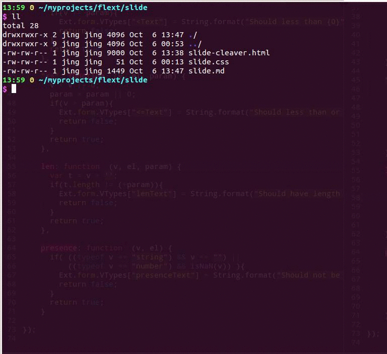

title: Ejext
controls: false
agenda: false
style: slide.css
author:
    name: Sarunyoo Wangwong
    url: sarunyoo@mfec.co.th

--

# Ejext
## EnJoy Building ExtJS Application :)

--

--

### W H Y | not ExtJS Designer?
* Huge Overhead -> Too many configuration options to set in ExtJS Designer to make it just work
* Steep Learning Curve -> The layouts that does not make any sense and complicate
* Hard to change -> Hard to re-position components
* Drag & Drop GUI-Based is not optimize way for doing repetitive tasks

--

### W H A T | The Ejext Is ?
* An alternative to ExtJS Designer which using extended YAML to define GUI configuation
* With a library that simplify ExtJS's API and extend some components for ease of use
* The compiler is written in Ruby script
* The generator's output is the same as ExtJS Designer:
  1. UI script, store the ui configuration of ExtJS components.
  2. Event script, where event handling of the components located.

--

### E X A M P L E S

--

### How to get start ? 
* Learning simple UI syntax ( <= 1 week )
* Setup Environment for the Generator

--

# Demo

